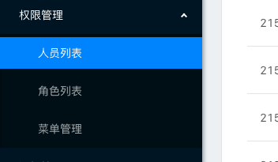
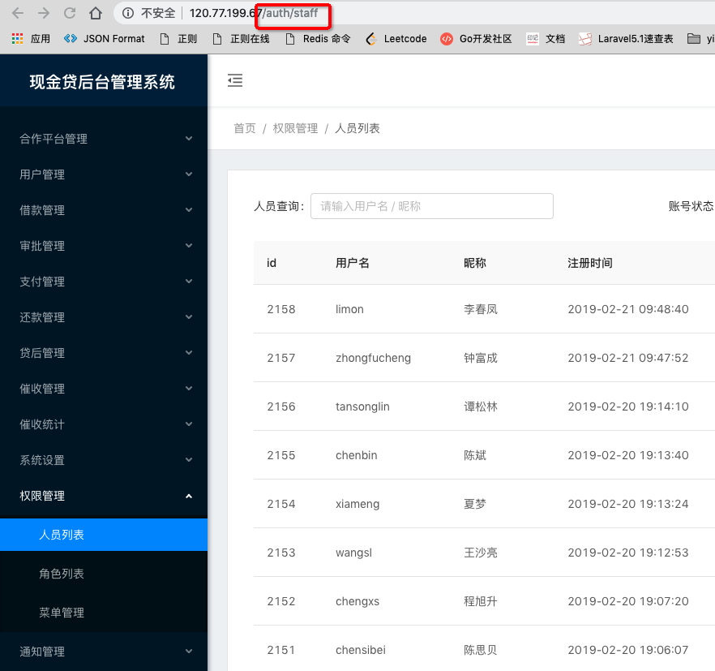
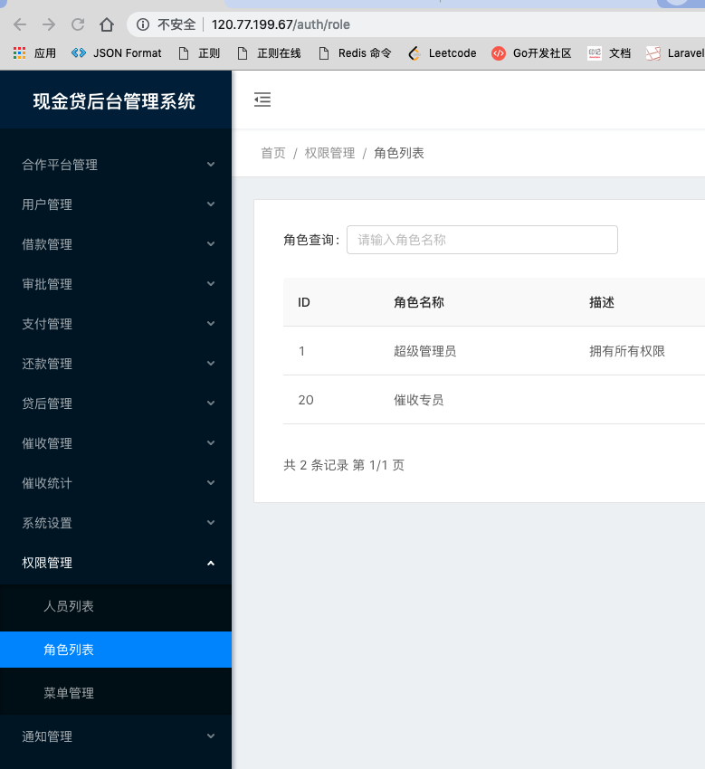
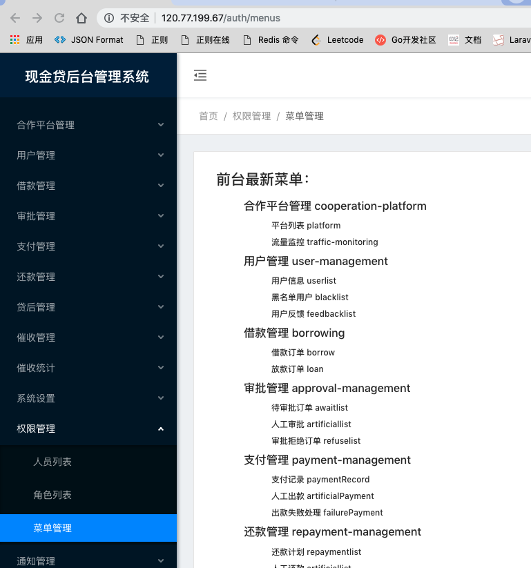
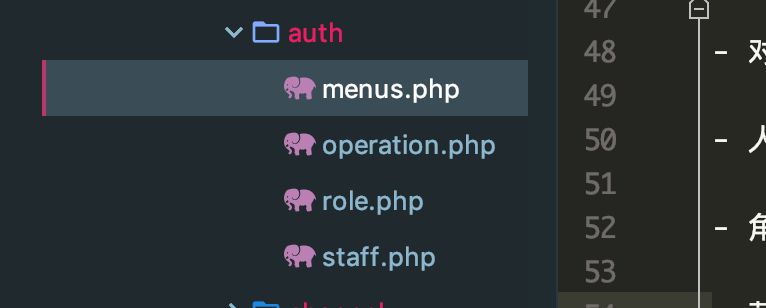
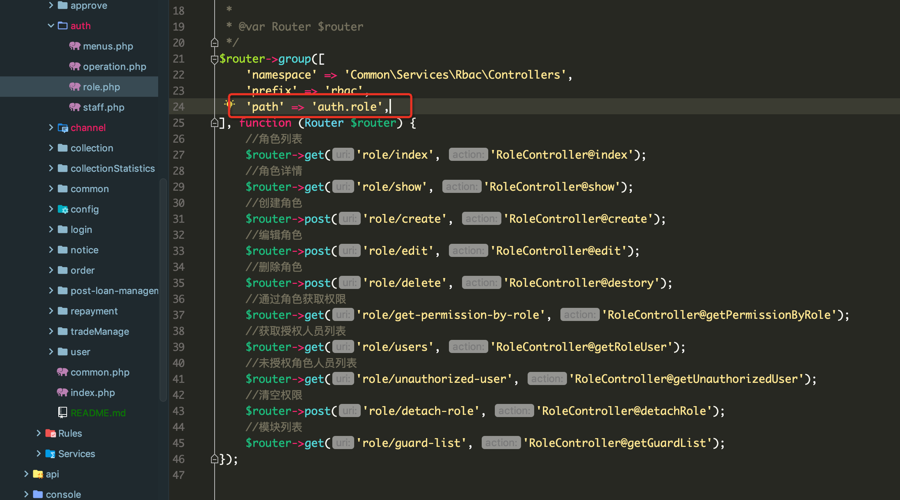
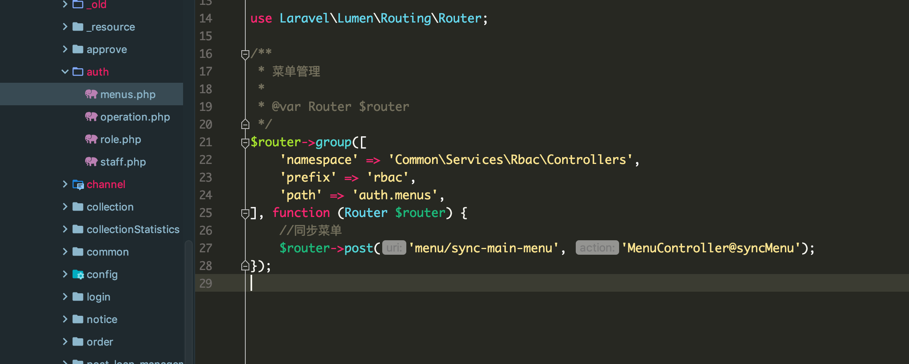
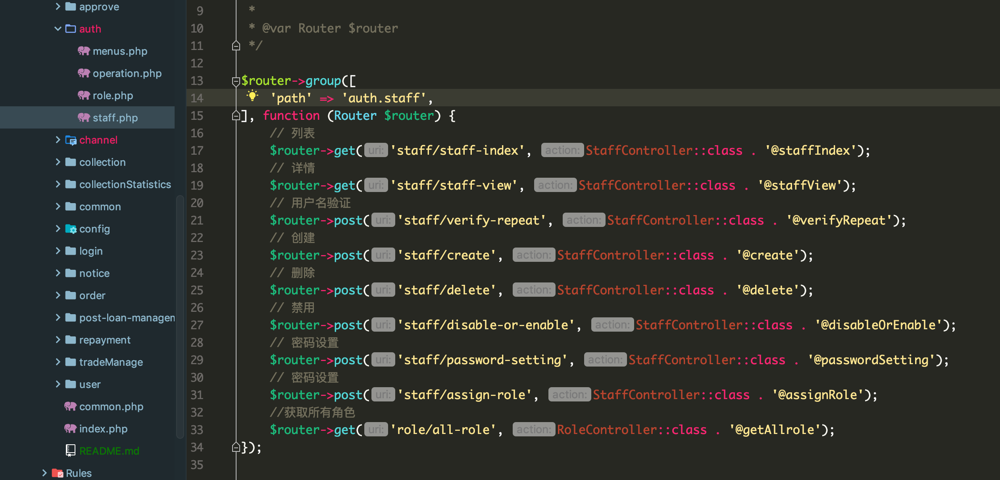

- 后台路由需要按照菜单分组,一个菜单对应一个文件.对应文件里面的接口都应该是这个菜单下面的.位置放错会导致RBAC认证失败!!!(有什么不懂的可以问陈思贝)

### 例子

- 现在有这些接口
    ```
    //同步菜单
    $router->post('menu/sync-main-menu', 'MenuController@syncMenu');
    //角色列表
    $router->get('role/index', 'RoleController@index');
    //角色详情
    $router->get('role/show', 'RoleController@show');
    //创建角色
    $router->post('role/create', 'RoleController@create');
    //编辑角色
    $router->post('role/edit', 'RoleController@edit');
    //删除角色
    $router->post('role/delete', 'RoleController@destory');
    //通过角色获取权限
    $router->get('role/get-permission-by-role', 'RoleController@getPermissionByRole');
    //获取授权人员列表
    $router->get('role/users', 'RoleController@getRoleUser');
    //未授权角色人员列表
    $router->get('role/unauthorized-user', 'RoleController@getUnauthorizedUser');
    //清空权限
    $router->post('role/detach-role', 'RoleController@detachRole');
    //模块列表
    $router->get('role/guard-list', 'RoleController@getGuardList');
    // 列表
    $router->get('staff/staff-index', StaffController::class . '@staffIndex');
    // 详情
    $router->get('staff/staff-view', StaffController::class . '@staffView');
    // 用户名验证
    $router->post('staff/verify-repeat', StaffController::class . '@verifyRepeat');
    // 创建
    $router->post('staff/create', StaffController::class . '@create');
    // 删除
    $router->post('staff/delete', StaffController::class . '@delete');
    // 禁用
    $router->post('staff/disable-or-enable', StaffController::class . '@disableOrEnable');
    // 密码设置
    $router->post('staff/password-setting', StaffController::class . '@passwordSetting');
    // 密码设置
    $router->post('staff/assign-role', StaffController::class . '@assignRole');
    //获取所有角色
    $router->get('role/all-role', RoleController::class . '@getAllrole');
    ```  
- 对应前台菜单<br/> 
<br/>
<br/>
- 人员列表对应前端路由<br/> 
<br/>
<br/>
- 角色列表对应前端路由<br/> 
<br/>
<br/>
- 菜单管理对应前端路由<br/> 
<br/>
<br/>

- 人员列表菜单对应请求的接口
    ```
        // 列表
        $router->get('staff/staff-index', StaffController::class . '@staffIndex');
        // 详情
        $router->get('staff/staff-view', StaffController::class . '@staffView');
        // 用户名验证
        $router->post('staff/verify-repeat', StaffController::class . '@verifyRepeat');
        // 创建
        $router->post('staff/create', StaffController::class . '@create');
        // 删除
        $router->post('staff/delete', StaffController::class . '@delete');
        // 禁用
        $router->post('staff/disable-or-enable', StaffController::class . '@disableOrEnable');
        // 密码设置
        $router->post('staff/password-setting', StaffController::class . '@passwordSetting');
        // 密码设置
        $router->post('staff/assign-role', StaffController::class . '@assignRole');
        //获取所有角色
        $router->get('role/all-role', RoleController::class . '@getAllrole');
    ```
- 角色列表菜单对应请求的接口
    ```
        //角色列表
        $router->get('role/index', 'RoleController@index');
        //角色详情
        $router->get('role/show', 'RoleController@show');
        //创建角色
        $router->post('role/create', 'RoleController@create');
        //编辑角色
        $router->post('role/edit', 'RoleController@edit');
        //删除角色
        $router->post('role/delete', 'RoleController@destory');
        //通过角色获取权限
        $router->get('role/get-permission-by-role', 'RoleController@getPermissionByRole');
        //获取授权人员列表
        $router->get('role/users', 'RoleController@getRoleUser');
        //未授权角色人员列表
        $router->get('role/unauthorized-user', 'RoleController@getUnauthorizedUser');
        //清空权限
        $router->post('role/detach-role', 'RoleController@detachRole');
        //模块列表
        $router->get('role/guard-list', 'RoleController@getGuardList');
    ```
- 菜单管理对应请求的接口
    ```
        //同步菜单
        $router->post('menu/sync-main-menu', 'MenuController@syncMenu');
    ```

 - 操作
    - 创建路由文件 menus.php role.php staff.php (名字可以随意起,保证一个菜单对应一个路由文件即可)<br/> 
    <br/>
    <br/>
    - role.php 文件对应前端的`角色列表`菜单,对应的前端路由为`auth/role`. role的路由文件增加path属性,对应前端的`auth/role`,`/` 用`.` 代替<br/> 
    <br/>
    <br/>
    - menus.php 文件对应前端的`菜单管理`菜单,对应的前端路由为`auth/menus`. menus的路由文件增加path属性,对应前端的`auth/menus`,`/` 用`.` 代替<br/> 
    <br/>
    <br/>
    - staff.php 文件对应前端的`人员列表`菜单,对应的前端路由为`auth/staff`. staff的路由文件增加path属性,对应前端的`auth/staff`,`/` 用`.` 代替<br/> 
    <br/>
    <br/>
     
        
 
